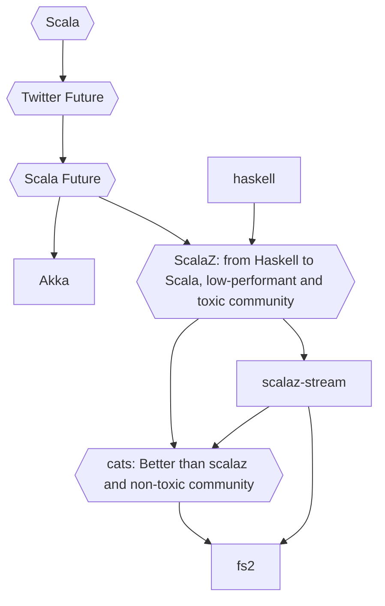

# What is IO?
---
`class IO(thunk: Thunk[A])` , thunk = statement or function without parameters

---

---
# ZIO = Zero-dependencies IO
---
## High-performance

Build scalable applications with 100x the performance of Scala’s Future

---
## Asynchronous, Type-safe, Concurrent,  Resource-safe, Resilient, Concurrent

Write sequential code that looks the same whether it’s asynchronous or synchronous
Build apps that never leak resources (including threads!), even when they fail
Build apps that never lose errors, and which respond to failure locally and flexibly
Rapidly compose solutions to complex problems from simple building blocks

---
The `ZIO[R, E, A]` data type has three type parameters:

-   **`R` - Environment Type**, **Input**. The effect requires an environment of type `R`. If this type parameter is `Any`, it means the effect has no requirements - .
-   **`E` - Failure Type**. The effect may fail with a value of type `E`. Some applications will use `Throwable`. If this type parameter is `Nothing`, it means the effect cannot fail, because there are no values of type `Nothing`.
-   **`A` - Success Type** **Outut**. The effect may succeed with a value of type `A`. If this type parameter is `Unit`, it means the effect produces no useful information, while if it is `Nothing`, it means the effect runs forever (or until failure).

---
# Runtime
A `Runtime[R]` is capable of executing tasks (`ZIO`) within an environment `R`.
  -  has two underlying exec contexts: non-blocking IO, blocking IO
  -  spawns concurrent fiber
  -  handles unexpected errors

---

# ZIO Ecosystem

Native Logging
Built-in Metrics
DI: Module Pattern