# 🩻 reveal — how the macro works

Developer documentation for `com.worxbend.reveal`. This is the *inside* of the library: what happens
at compile time, what survives into your bytecode, and why the pieces are arranged the way they are.

For **using** the library, see the [README](README.md).

---

## 📑 Contents

- [The one idea](#the-one-idea)
- [Component map](#component-map)
- [The two entry points](#the-two-entry-points)
- [The expansion pipeline](#the-expansion-pipeline)
- [Resolving a field's type](#resolving-a-fields-type)
- [What gets expanded, what gets delegated](#what-gets-expanded-what-gets-delegated)
- [Field rules and the safety model](#field-rules-and-the-safety-model)
- [The reachability scan](#the-reachability-scan)
- [Nesting budgets](#nesting-budgets)
- [A worked expansion](#a-worked-expansion)
- [Runtime sequence](#runtime-sequence)
- [Source map](#source-map)

---

## The one idea

**Everything decidable from declared types is decided once, at compile time. What survives into your
bytecode is straight-line string assembly plus the `Configuration` reads that genuinely cannot be
resolved earlier.**

There is no reflection at render time, no `Mirror` traversal, no per-call map building.

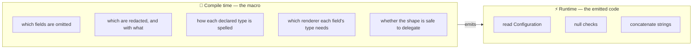

The split is the whole design. If a decision depends only on types and annotations it belongs on the
left; if it depends on the *value* or on the ambient `Configuration` it belongs on the right.

---

## Component map

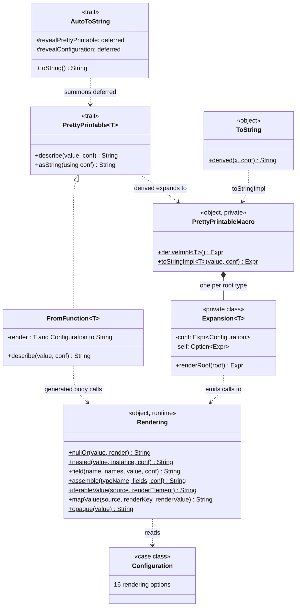

`Rendering` is the only part that exists at runtime as ordinary code. Everything the macro emits is a
call into it.

---

## The two entry points

| Entry point | Shape | `self` available? | Configuration |
| :-- | :-- | :-- | :-- |
| `PrettyPrintable.derived[T]` | produces an **instance** | ✅ yes — enables self-recursion | lambda parameter, already stable |
| `ToString.derived(this)` | renders **in place** | ❌ no | `inline` param, so bound to a `val` first |

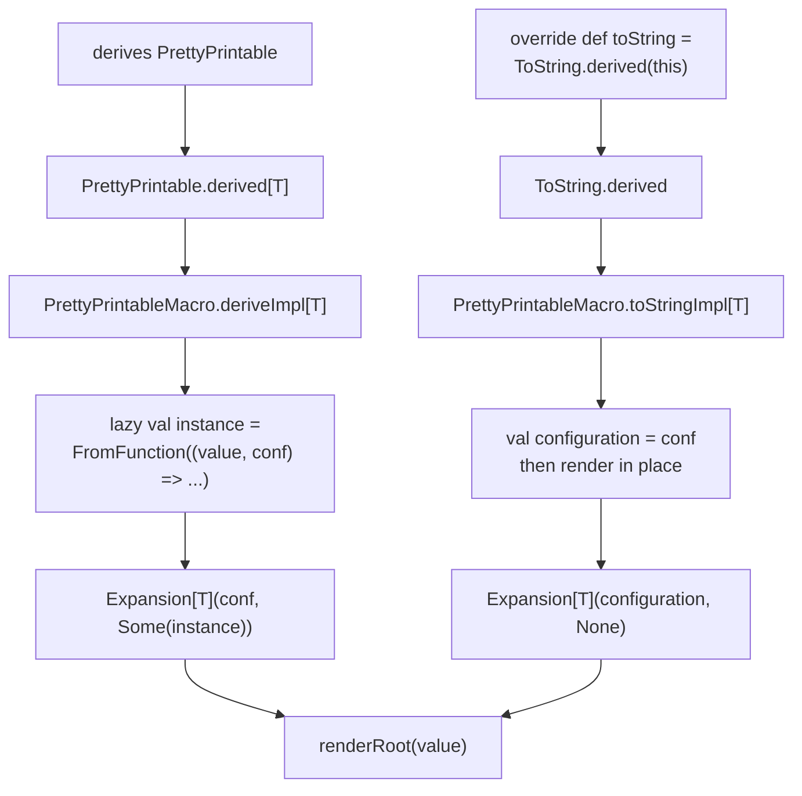

> [!NOTE]
> `toStringImpl` binds the configuration to a `val` before rendering. An `inline` parameter creates no
> binding — the argument tree is substituted at **every** occurrence, and the expansion reads the
> configuration roughly twice per field per level. A fifteen-node model measured **30 evaluations** of
> the caller's expression. Binding makes it one, and guarantees a single render cannot mix two
> configurations.

---

## The expansion pipeline

One `Expansion` instance per expanded root type. It holds the configuration expression, the optional
self-instance, and one fixed `Quotes` context.

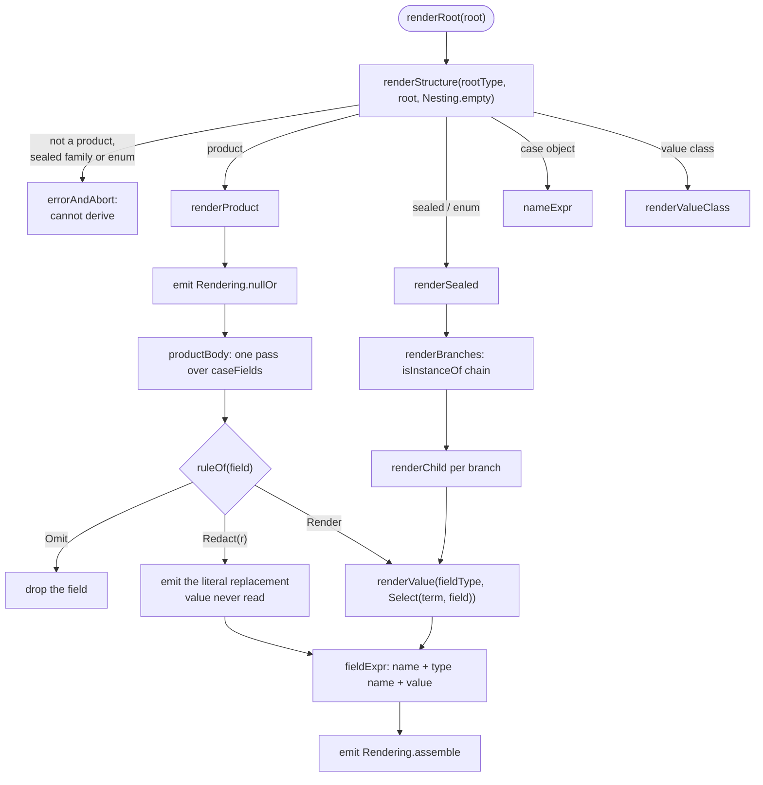

Note that `renderValue` is reached recursively from `productBody`, `renderChild`, and every collection
renderer — that recursion is ordinary Scala recursion running at **staging level 0**, which the
compiler neither counts nor bounds. That is precisely why the budgets in
[Nesting budgets](#nesting-budgets) have to exist.

---

## Resolving a field's type

`renderValue` is an ordered chain. **First match wins.**

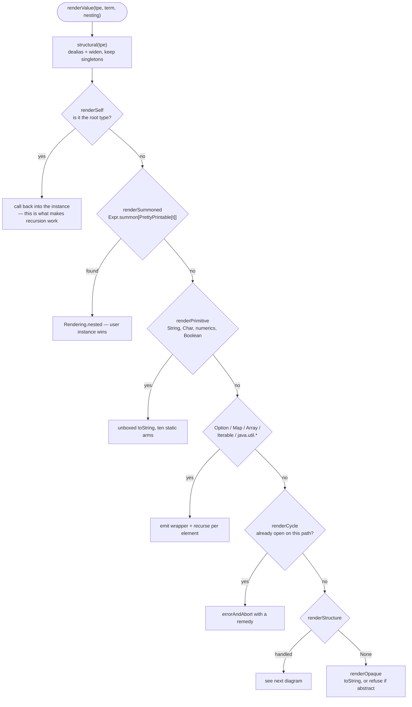

> [!IMPORTANT]
> `renderSelf` **must** stay first. If `renderSummoned` ran ahead of it, implicit search would find the
> very instance being constructed and inline it into itself.
>
> `renderSummoned` sits ahead of `renderPrimitive` so a user-supplied `given` really does win for
> `String`, `Char` and the numerics too. The cost is one implicit search per scalar field, at expansion
> time only.

---

## What gets expanded, what gets delegated

This is the decision that shapes the library. **A nested case class is never unrolled into its
parent.**

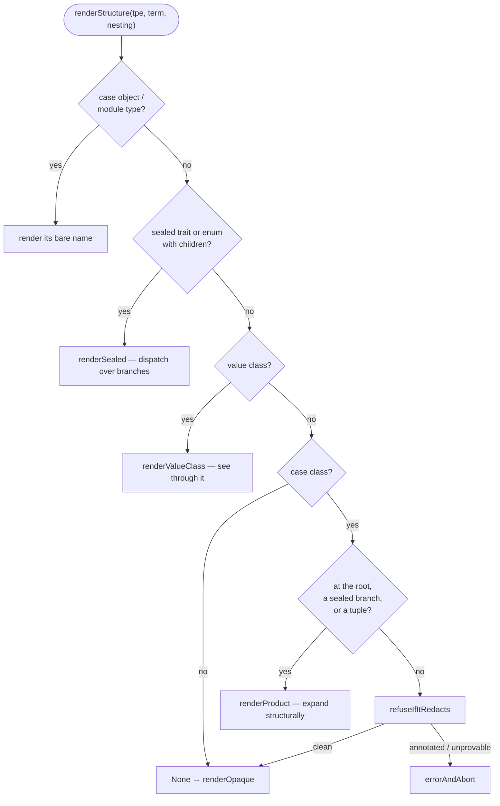

| Shape | Expanded? | Why |
| :-- | :-- | :-- |
| the root type | ✅ | it is what you wrote `derives` on |
| a sealed branch | ✅ | it has no instance of its own to delegate to |
| a **tuple** | ✅ | nobody can write `derives` on `Tuple2`, so it could never earn structure back |
| a value class | ✅ | seeing through it is the entire point |
| a case object / enum case | ✅ | rendered by name |
| **any other nested case class** | ❌ | delegates to its own instance, else plain `toString` |

Delegating keeps a derivation's emitted size bounded by *one type's own fields*, rather than growing
with the whole reachable object graph.

---

## Field rules and the safety model

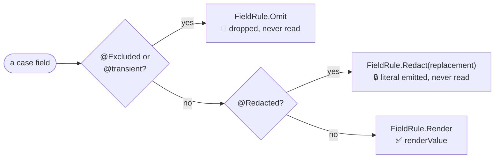

Three properties fall out of resolving this **once per field at expansion time**:

1. **Exclusion beats redaction.** Both annotations on one field → omitted. Source order is irrelevant.
2. **Omitted and redacted values are never dereferenced** — not for the value, not for a type name, not
   for a null check. A field whose getter throws still renders.
3. **Repeated `@Redacted`** → the one written *first* in source order, via `sortBy(_.pos.start)`.

---

## The reachability scan

A nested case class without an instance renders with `toString` — and **`toString` ignores `@Redacted`
at every depth**, not just on the type named in the field. So before delegating, the macro walks what
that `toString` would expose.

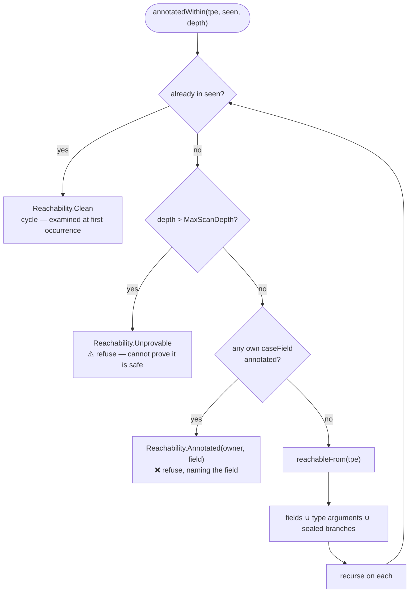

Two things this gets right that a naive version does not:

- **Abstract types are deliberately not filtered out.** A `List[Secret]` field and a sealed-trait field
  are both abstract at the top; skipping them would hide exactly the descendants the scan exists to
  find. Their type arguments and branches are the interesting part.
- **`seen` alone is not enough.** A type whose arguments grow at every step never repeats:

  ```scala
  final case class Growth[A](next: Option[Growth[List[A]]])
  // Growth[Int] -> Growth[List[Int]] -> Growth[List[List[Int]]] -> ...
  ```

  There is no cycle to detect, and without `MaxScanDepth` the walk **hung the compiler outright**
  rather than failing it. `Unprovable` is why the bound is safe to have: hitting it refuses rather
  than assuming the shape is clean.

---

## Nesting budgets

Expansion recurses in the macro, not in the compiler's inliner, so nothing bounds it automatically.
`-Xmax-inlines` never applies: `derived` is a single `inline def` whose body is a single splice, so
the compiler's counter never rises above one however deep the model.

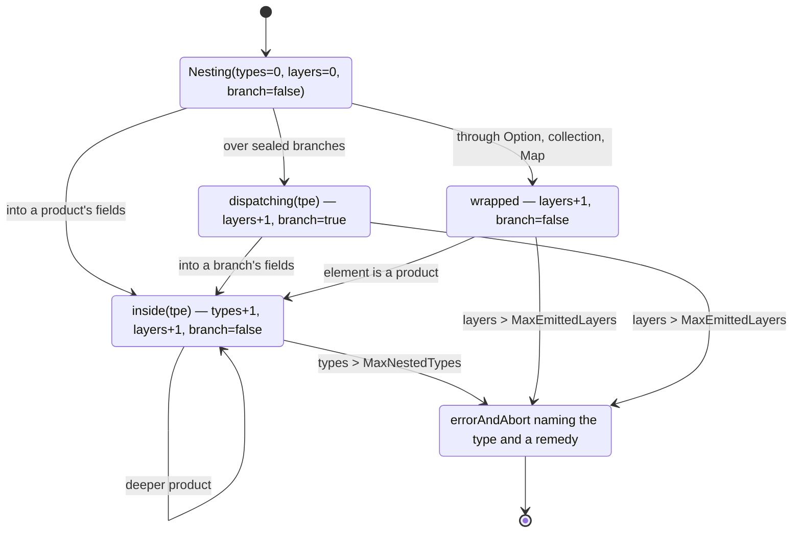

| Budget | Value | Counts | Binds on |
| :-- | :-- | :-- | :-- |
| `MaxNestedTypes` | 12 | products, value classes, sealed families below the root | deep sealed/value chains |
| `MaxEmittedLayers` | 20 | every emitted layer, wrappers included | binds first — a sealed chain refuses at 11 levels |
| `MaxScanDepth` | 64 | reachability-scan depth only | argument-growing recursive types |

`branch` exists because **depth alone cannot distinguish the two kinds of case class**: a sealed family
reached through a field is already one type deep, but its branches must still expand.

> Both nesting caps were measured, not derived. At `-Xss1m` a plain chain overflows at 13 types;
> at the `-Xss10m` this repository builds with, 140 types compile fine. They are calibrated for the
> small-stack case, which is the one that fails destructively.

---

## A worked expansion

```scala
final case class Account(id: Long, @Redacted password: String, roles: List[String])
    derives PrettyPrintable
```

expands to roughly this — every decision already made, nothing left to look up:

```scala
lazy val instance: PrettyPrintable[Account] =
  PrettyPrintable.FromFunction[Account]((value, conf) =>
    Rendering.nullOr[Account](value, bound =>
      Rendering.assemble(
        "Account",
        List(
          Rendering.field("id",       "Long",   "scala.Long", "s.Long", bound.id.toString,        conf),
          Rendering.field("password", "String", "java.lang.String", "j.l.String", "<redacted>",   conf),
          //                                                                      ^ literal: never reads bound.password
          Rendering.field("roles",    "List",   "scala.collection.immutable.List", "s.c.i.List",
            Rendering.nullOr(bound.roles, xs =>
              Rendering.iterableValue(xs, (item: String) => Rendering.string(item))), conf),
        ),
        conf,
      )
    )
  )
```

Every type name is a compile-time string literal. The redacted field is a literal too — `bound.password`
appears nowhere in the emitted tree.

---

## Runtime sequence

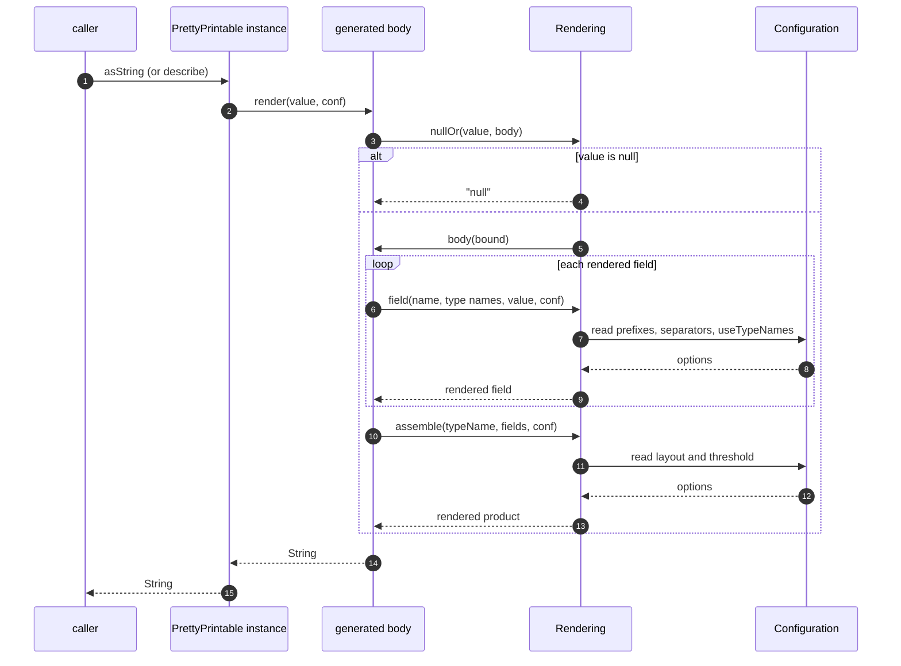

Compile-time, for contrast:

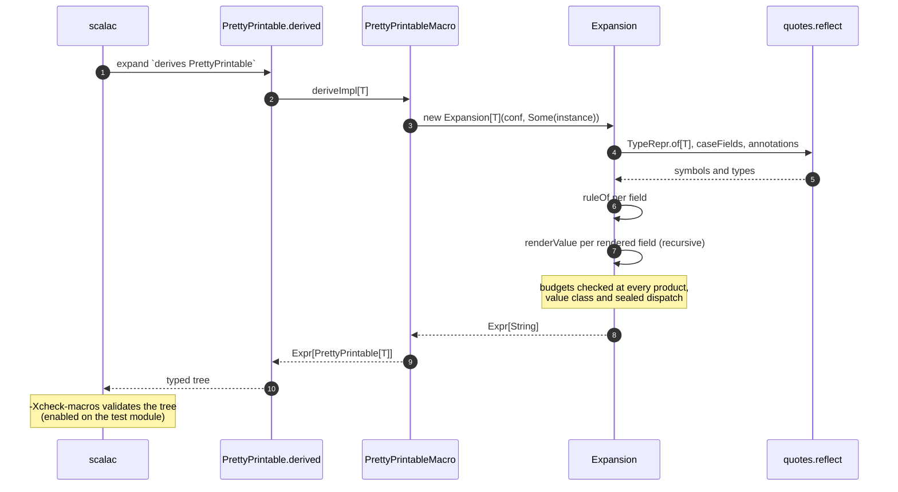

---

## Source map

| File | Holds |
| :-- | :-- |
| `PrettyPrintable.scala` | the trait, `FromFunction`, `derived`, `AutoToString`, the `ToString` shim |
| `PrettyPrintableMacro.scala` | `deriveImpl`, `toStringImpl`, the `Expansion` class, all budgets and rules |
| `Rendering.scala` | everything that exists at runtime: escaping, `null`, layout, assembly |
| `Configuration.scala` | the sixteen options |
| `annotations.scala` | `@Redacted`, `@Excluded` |

Inside `PrettyPrintableMacro`, the members are grouped in the order the expansion uses them: nesting →
symbols → type predicates → names → annotations → value renderers → structure → budgets → product
shape → sealed shape → root.

### Working on it

```bash
./mill libs.commons.reveal.test          # 217 tests
./mill libs.commons.reveal.checkFormat   # scalafmt
```

`-Xcheck-macros` is enabled on the **test** module, because that is where expansion actually happens.
It validates the trees the macro hand-builds and catches scope extrusion.

> [!WARNING]
> The `-Xcheck-macros` guard is **partial**. It catches an `Expr` that escapes its splice — which is why
> the sealed-dispatch path is clean — but not one laundered through `.asTerm`, which is the shape the
> product path uses. A regression on the product side would compile silently.
